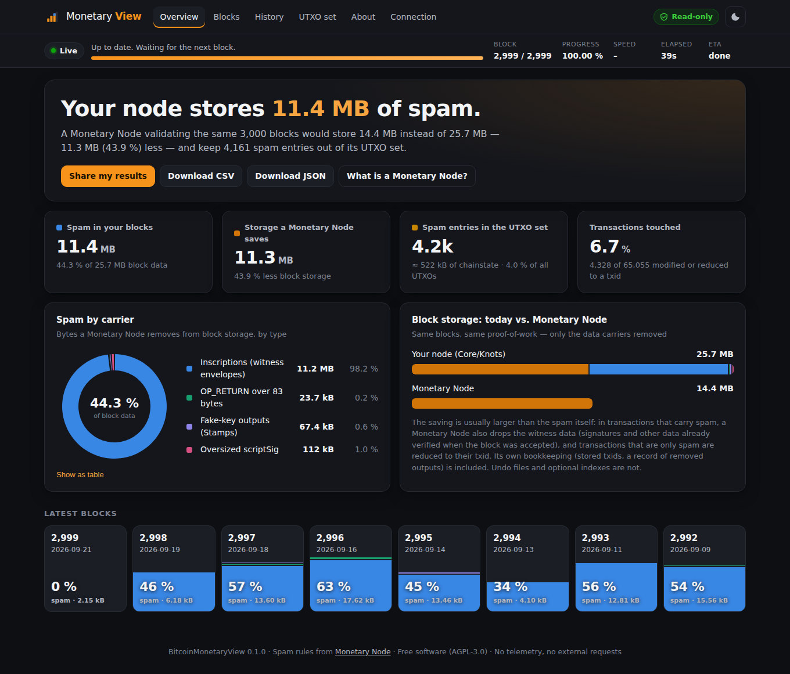

# BitcoinMonetaryView

**See how much spam your Bitcoin node stores — and what a Monetary Node would save.**

BitcoinMonetaryView connects to your own Bitcoin Core or Bitcoin Knots node, analyses every block of the
chain with the rules of the [Monetary Node](https://github.com/sambitcoin/BitcoinMonetaryNode) project and
shows, in a web dashboard:

- how much of each block is spam (inscriptions, oversized OP_RETURN, Stamps-style fake keys, oversized scriptSig),
- how much block storage a Monetary Node would save,
- how many spam and dust entries sit in your UTXO set right now, and how old they are,
- how all of this developed over the whole history of Bitcoin.



It is meant for people who run Core or Knots today and are considering a Monetary Node: it shows the
benefits on *their own* node, with *their own* data.

> **Read-only.** The app never changes anything on your node. It talks to it only through a fixed whitelist
> of read-only RPC calls, never touches the node's files, and keeps its results in its own separate database.

---

## Quick start

Requirements: Python 3.10+ (standard library only — nothing to install) and a Bitcoin Core or Knots node.

```bash
git clone https://github.com/MarkSierra/BitcoinMonetaryView
cd BitcoinMonetaryView

# Same machine as the node (uses bitcoind's cookie file, read-only):
python3 -m bitcoinmonetaryview --rpc-cookie-file ~/.bitcoin/.cookie

# Another machine on your network:
BMV_RPC_URL=http://192.168.1.20:8332 BMV_RPC_USER=myuser BMV_RPC_PASSWORD=mypassword \
  python3 -m bitcoinmonetaryview
```

Then open <http://127.0.0.1:8338/>. Check the connection first with `--check`:

```bash
python3 -m bitcoinmonetaryview --rpc-cookie-file ~/.bitcoin/.cookie --check
```

### Connecting to a node on another computer

Your node only accepts RPC from localhost by default. On the node, add to `bitcoin.conf` (adapt the network):

```ini
server=1
rpcbind=0.0.0.0            # or the node's LAN address
rpcallowip=192.168.1.0/24  # your local network
rpcauth=...                # create with Bitcoin Core's share/rpcauth/rpcauth.py
# optional, about halves the transfer size:
rest=1
```

Plain `http://` RPC sends your RPC password unencrypted over the network — fine on a trusted home LAN,
otherwise use an `https://` URL, Tor or an SSH tunnel (`ssh -L 8332:127.0.0.1:8332 node`). The app warns you
when it detects plain HTTP to another machine.

### Start9 (StartOS)

**Native package (StartOS 0.4):** [BitcoinMonetaryView-startos](https://github.com/MarkSierra/BitcoinMonetaryView-startos)
runs the app on your Start9 next to Bitcoin Core / Knots, connects automatically and needs no setup. It is not
in the Start9 marketplace yet: download the `.s9pk` for your architecture from that repo's latest *Build* run
(Actions → Build → Artifacts) and install it via System → Sideload. Updates keep your scan results.

**From another computer:** use the RPC connection details shown in your Bitcoin Core / Knots service
(Interfaces / Properties). StartOS serves LAN RPC over HTTPS with its own certificate authority: download your
Start9 root CA and pass it with `--rpc-cafile` (TLS verification is never disabled). Over Tor:
`--rpc-url http://<rpc-address>.onion:8332 --tor-proxy 127.0.0.1:9050`.

Packaging details: [docs/startos.md](docs/startos.md).

### Docker

```bash
cp docker-compose.example.yml docker-compose.yml   # edit RPC settings
docker compose up -d
```

The container runs as a non-root user with a read-only root filesystem; only its data volume is writable.

Released versions are also published as a ready-made multi-arch image (x86_64 and ARM64):
`ghcr.io/marksierra/bitcoinmonetaryview:latest` (or a fixed version such as `:0.1.0`) — use it as
`image:` instead of `build: .` in the compose file, or fetch it with
`docker pull ghcr.io/marksierra/bitcoinmonetaryview:latest`.

---

## How the scan works

1. **Quick pass** — the latest 1,000 blocks, so you see real numbers within minutes.
2. **Full history scan** — every block from the genesis block to the tip, in order. This is what makes the
   exact UTXO numbers possible: every spam output is tracked from the block that created it until it is spent.
   It is resumable: stop the app at any time and it continues where it stopped.
3. **Live** — afterwards, new blocks are analysed as they arrive (less than a second of work per block).
   Chain reorganisations are detected and rolled back exactly.

A status bar on every page shows what the app is doing right now, progress, speed and ETA.

### Will it slow down my node?

The node's work is reading and sending blocks. The app limits that:

| Profile | What it does |
|---|---|
| **Eco** (default) | one request at a time, pauses after every block, one CPU core |
| **Balanced** | two parallel requests, short pauses, analysis on up to 2 CPU cores |
| **Full speed** | up to four parallel requests, analysis on up to 4 CPU cores (one core is always left free) |

In every profile the app backs off automatically when your node answers slowly, waits while the node is
still syncing, and can be limited to a daily time window (e.g. `--scan-window 01:00-07:00`) or paused.

### How long does the full scan take?

Roughly — the dashboard shows the measured ETA after a few minutes. Measured on a 4-core machine against a
fake node: ~9 MB/s (Eco), ~27 MB/s (Balanced), ~36 MB/s (Full speed) of block data; the real node's disk and
network add to that:

| Hardware | Full speed | Eco |
|---|---|---|
| Start9 / Umbrel-class, SSD | ~12–24 hours | ~2–4 days |
| Desktop / NVMe, 4+ cores | ~5–8 hours | ~1 day |

Over Wi-Fi it is slower; over Tor a full scan is impractical (days to weeks) — use the LAN or run the app on
the node's machine. The app's own database grows to roughly 4–8 GB after a full mainnet scan.

---

## What counts as spam

The rules are taken unchanged from the Monetary Node project (`tools/monetary_store.py`, pinned to upstream
commit `492539256d43`, see [NOTICE](NOTICE)):

| Carrier | Rule | Effect in a Monetary Node |
|---|---|---|
| Inscriptions | data in `OP_FALSE OP_IF … OP_ENDIF` envelopes in taproot script-path / P2WSH witnesses | removed from block storage |
| OP_RETURN | scripts over 83 bytes (verified payment-protocol envelopes kept, see below) | removed from block storage |
| Stamps / fake keys | bare multisig or P2PK whose keys are not points on secp256k1 | removed from blocks and the UTXO set |
| scriptSig | input scripts over 1,650 bytes | removed from block storage |
| P2TR dust | taproot outputs under 1,000 sats since block 767,430 | kept in blocks, removed from the UTXO set |

**Carrier policy** (`--carrier-policy`, default on): upstream's `carrier_policy.py` keeps oversized OP_RETURNs
that are exactly-parsed Shielded Bitcoin payment envelopes. Upstream documents this but has not wired it into
`monetary_store.py` yet; this app wires it in exactly as upstream's `CARRIER_POLICY.md` describes. With it off,
the results equal the ruleset of upstream's published figures.

**"Storage saved"** compares the original block size with the exact size of the Monetary Node's store record
(which includes the txids and filter entries it keeps). Undo files and optional indexes are not counted, so the
number is not overstated.

Every analysed block is verified before it is counted: its hash must match the header, the merkle root must
match the transactions, and the witness commitment must match the witness data.

Known upstream behaviours that are kept for comparability (reported upstream): hybrid-encoded P2PK keys
count as data; envelopes in single-item P2WSH witnesses and in taproot script-path spends that carry an annex
are not detected; the last item of any multi-item witness is parsed as a script. The carrier policy only adds
exemptions: the OP_RETURN size test stays upstream's script-length rule.

---

## Security

- **Read-only by construction**: the RPC client refuses every method that is not on a short whitelist
  (`getblockchaininfo`, `getnetworkinfo`, `getbestblockhash`, `getblockcount`, `getblockhash`,
  `getblockheader`, `getblock` with verbosity 0, `gettxoutsetinfo` with `hash_type=none`) — also inside batch
  requests and with forbidden parameters. REST (`rest=1`) is used only if you have already enabled it.
- **No access to the node's files.** Only the RPC cookie file is read, if you point to it — opened read-only.
  No `dumptxoutset` (it would write a large file on the node).
- **Web interface**: listens on `127.0.0.1` by default. If you expose it (`--bind 0.0.0.0`), set
  `--auth-user/--auth-password` and ideally `--tls-cert/--tls-key`. State-changing requests (pause, rescan,
  scan settings — all affecting only this app) need a CSRF token; a Host allowlist protects against DNS
  rebinding; a strict Content-Security-Policy is sent; credentials are never returned by the API or logged.
- **Privacy**: no telemetry, no external requests — no fonts, no CDNs, no price feeds. The app only talks to
  your node.
- **Supply chain**: zero third-party Python packages.

See [SECURITY.md](SECURITY.md) to report a vulnerability.

---

## Settings

All settings work as command-line flags, environment variables (`BMV_…`) or in `settings.json` in the data
directory (default `~/.bitcoinmonetaryview`). See [docs/settings.md](docs/settings.md).

## Development

```bash
python3 -m unittest discover -s tests -t .      # all tests
python3 -m tests.demo                            # dashboard against a fake node with a synthetic chain
BMV_BITCOIND=/path/to/bitcoind python3 -m unittest tests.test_regtest   # real regtest node
```

The test suite checks byte-for-byte parity with upstream's `strip_block`, runs upstream's own test suites
against the vendored files, uses real blocks from Bitcoin Core's test data, fuzzes the parser, simulates
reorgs, restarts and tampered blocks, and verifies the web server's security properties.

**Validation against upstream's published figures:** on a full mainnet node, scan with
`--carrier-policy false` and compare the totals for blocks 767,430–962,292 with upstream's
[results](https://github.com/sambitcoin/BitcoinMonetaryNode#the-result) (37.2 GB spam removed).

## License

[AGPL-3.0-or-later](LICENSE) — free software: use, study, share and improve it; if you distribute a modified
version or offer it as a network service, publish your source. The vendored Monetary Node files remain under
their BSD-2-Clause license ([NOTICE](NOTICE)).
